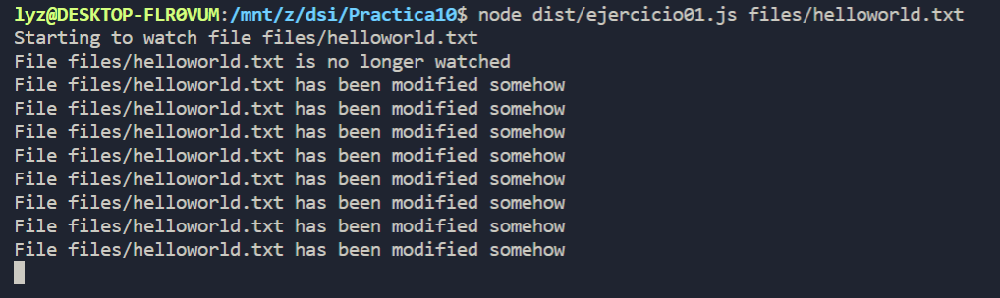
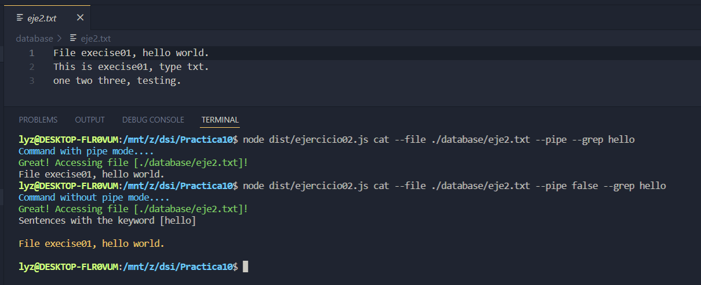
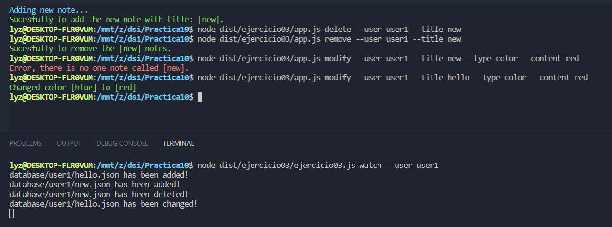
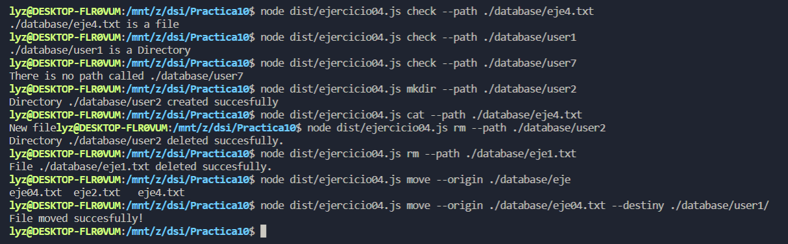
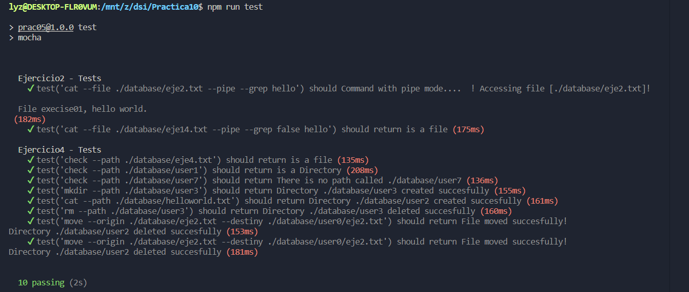

# Práctica 10 - Sistema de ficheros y creación de procesos en Node.js
```
Autora: Xue Mei Lin
Curso: 2021- 2022
Universidad: Universidad de La laguna
Asignatura: Desarrollo de Sistemas Informaticos
Herramienta: Visual Studio Code
Lenguaje de programción: TypeScipt
```
## 1. Introducción
Hemos aprendido en esta practica como hacer una serie de ejercicios o retos a resolver haciendo uso de las APIs proporcionadas por Node y js para actuar el sistema de ficheros.
## 2. Objetivos

## 3. Ejercicios realizados
### 3.1 Ejercicio 1
En este ejercicio, lo que vamos a hacer es lo siguiente. Por un lado se realiza una traza de ejercicio respecto al siguiente programa, mostrará cada iteración sobre el contenido de la pila de llamadas, el registro de eventos de la API, la cola de manejadores de Node.js y la información que muestra por la consola.
```
import {access, constants, watch} from 'fs';

if (process.argv.length !== 3) {
  console.log('Please, specify a file');
} else {
  const filename = process.argv[2];

  access(filename, constants.F_OK, (err) => {
    if (err) {
      console.log(`File ${filename} does not exist`);
    } else {
      console.log(`Starting to watch file ${filename}`);

      const watcher = watch(process.argv[2]);

      watcher.on('change', () => {
        console.log(`File ${filename} has been modified somehow`);
      });

      console.log(`File ${filename} is no longer watched`);
    }
  });
}
```
**La traza de ejecución es lo siguiente:**


> En el inicio, todos están en un estado vació: 
>
> - Pila de llamadas: nada
> - Registro de eventos: nada
> - Cola de manejadores: nada
> - Consola: nada

> En la 1 iteración, main entra a la pila de llamadas para empezar a funcionar
>
> - Pila de llamadas: main
> - Registro de eventos: nada
> - Cola de manejadores: nada
> - Consola: nada

> En la 2 iteración, es la comprobación del fichero, atraves de la constante F_OK, y la función de access entra a la pila de llamada: 
>
> - Pila de llamadas: access, main
> - Registro de eventos: nada
> - Cola de manejadores: nada
> - Consola: nada

> En la 3 iteración, como access no es un elemento de JavaScript, por lo tanto, pasa a ser un registro de eventos: 
>
> - Pila de llamadas: main
> - Registro de eventos: access
> - Cola de manejadores: nada
> - Consola: nada


> En la 4 iteración, el manejador de access pasa a la cola de manejadores, asimismo, access sale de Registro de eventos
>
> - Pila de llamadas: main
> - Registro de eventos: nada
> - Cola de manejadores: manejador access
> - Consola: nada

> En la 5 iteración, el manejador access pasa a la pila de llamadas, puesto que es el primer de la cola de manejadores
>
> - Pila de llamadas: manejador access
>
> - Registro de eventos: nada
>
> - Cola de manejadores: nada
>
> - Consola: nada

>   En la 6 iteración, se ejecuta el manejador access, y ejecuta también el primer console.log(File ${filename} does not exist);
>
>   - Pila de llamadas: manejador access, console.log(Starting to watch file ${filename})
>   - Registro de eventos: nada
>   - Cola de manejadores: nada
>   - Consola: nada

>   - En la 7 iteración, es la ejecucuion del console.log, mostrará mensaje por la pantalla: 
>   - Pila de llamadas: manejador access
>   - Registro de eventos: nada
>   - Cola de manejadores: nada
>   - Consola: Starting to watch file helloworld.txt

> En 8 iteración, entra const watcher = watch(process.argv[2]) a la pila de llamadas: 
> - Pila de llamadas: what(process,argv[2]) manejador access
> - Registro de eventos: nada
> - Cola de manejadores: nada
> - Consola: Starting to watch file helloworld.txt

> En la 9 iteración, como watch tampoco es un elemento de JavaScript, entonces pasa a ser un resgitro de eventos: 
> - Pila de llamadas: manejador access
> - Registro de eventos: watch(process.argv[2])
> - Cola de manejadores: nada
> - Consola: Starting to watch file helloworld.txt

> En la 10 iteración, watch() sale del registro de eventos: 
>
> - Pila de llamadas: manejador access
> - Registro de eventos: nada
> - Cola de manejadores: nada
> - Consola: Starting to watch file helloworld.txt

> En la 11 iteración, watcher.on("change") pasa a la pila de llamadas: 
> - Pila de llamadas:  wtach.on("change") manejador access
> - Registro de eventos: nada
> - Cola de manejadores: nada
> - Consola: Starting to watch file helloworld.txt

> En la 12 iteración, watcher pasa al registros de eventos, con el mismo motivo que antes(no pertenece a JavaScript): 
>
> - Pila de llamadas: manejador access
> - Registro de eventos: watcher.on("change")
> - Cola de manejadores: nada
> - Consola: Starting to watch file helloworld.txt

>  En la 13 iteración, watcher.on sigue en la ejercución, y console.log pasa a la pila de llamadas: 
>
> - Pila de llamadas:  console.log(File ${filename} is no longer watched); manejador access 
> - Registro de eventos: watcher.on("change")
> - Cola de manejadores: nada
> - Consola: Starting to watch file helloworld.txt

> En la 14 iteración, se ejecuta el console.log(File ${filename} is no longer watched);
> - Pila de llamadas:  manejador access
> - Registro de eventos: watcher.on("change")
> - Cola de manejadores: nada
> - Consola: Starting to watch file helloworld.txt File helloworld.txt is no longer watched

>  En la 15 iteración, el manejador access sale de la pila, y la pila se cuentra en un estado vacío, el programa espera que realiza algún cambio sobre el fichero introducido: 
>
> - Pila de llamadas:  nada
>
> - Registro de eventos: watcher.on("change")
>
> - Cola de manejadores: console.log(File ${filename} has been modified somehow);
>
> - Consola: Starting to watch file helloworld.txt File helloworld.txt is no longer watched

>  En la 16 iteración, lo que está en la cola de manejadroes pasa a la pila  y realiza su ejercucion: 
>
> - Pila de llamadas:  console.log(File ${filename} has been modified somehow);
>
> - Registro de eventos: watcher.on("change")
>
> - Cola de manejadores: nada
>
> - Consola: Starting to watch file helloworld.txt File helloworld.txt is no longer watched

>  En la 17 iteración ejecuta el console.log y mostrando el mensaje por la pantalla: 
>
>  - Pila de llamadas:  nada
>
>  - Registro de eventos: watcher.on("change")
>
>  - Cola de manejadores: nada
>
>  - Consola: Starting to watch file helloworld.txt File helloworld.txt is no longer watched 
>
>   ​                       console.log(File ${filename} has been modified somehow);

>  En la 18 iteración, si modificamos otra vez el fichero, se repite el mismo que lo las iteraciones anteriores: 
>  - Pila de llamadas:  nada
>
>  - Registro de eventos: watcher.on("change")
>
>  - Cola de manejadores: nada
>
>  - Consola: Starting to watch file helloworld.txt File helloworld.txt is no longer watched 
>
>    ​                console.log(File ${filename} has been modified somehow); 
>
>    ​                console.log(File ${filename} has been modified somehow);
>
>  En la ultima iteración, se cerra el programa, todos los elementos salen de registro de eventos.

**¿Qué hace la función `access`?**

fs.access:: es una funcion de `fs`, lo cual, es una función asíncrona que comprueba los permisos que tiene el usuario que intenta ejecutar el programa, con respecto al fichero que aporta en la ejecución. Si tiene los permisos suficiente, la función procede a seguir.

**¿Para qué sirve el objeto `constants`?**

fs.constants: es una funcion de `fs`, que contiene todo los valores (flags) para `fs.access`. En otras palabras, `fs.access` debe recibir unas de las siguientes constantes `R_OK`, `W_OK`, `X_OK` (flas de permisos de lectura, escritua, ejeccion respectivamente), según lo recibido se comprueba el permiso en específico del usuario. En este caso usa ‘F_OK’ para comprobar si el usuario puede ver el fichero.

**El resultado final es lo siguiente:**
F_OK: Comprueba si el fichero existe. Pero no comprueba sus permisos
R_OK: Comprueba si el fichero puede ser leído
W_OK: Comprueba si un fichero puede ser escrito
X_OK: Comprueba si un fichero puede ser ejecutado



### 3.2 Ejercicio 2 ###
En este ejericio, usamos el paquete `yargs` para el uso de comandos. Además para dicho ejercicio
haremos dos funciones para los siguientes requisitos:
1. Haciendo uso del método pipe de un Stream para poder redirigir la salida de un comando hacia otro.
2. Sin hacer uso del método pipe, solamente creando los subprocesos necesarios y registrando manejadores a aquellos eventos necesarios para implementar la funcionalidad solicitada.

En el caso de que hay que usar pipe. simplemente usamos `cat.stdoout.pipe(grep.stdin)`.
En otro caso, simplemente creamos un subproceso, y cremos una variable para guardar el resulado.

### 3.3 Ejercicio 3 ###
En este ejericicio, usamos la funcion watch para detectar los cambios de fichero, como comando, solo tiene un parametro que es el usuario. Ejecutamos en el terminar el comando 
`node dist/ejercicio03/ejercicio03.js watch --user user1`
y abrimos otro terminado ,  usando la practica anterior, si ejecutamos los siguientes comandos de la practica anterior
```
node dist/app.js add --user="User3" --title="TestNote_01" --body="This is a test note." --color="blue"
```
```
node dist/app.js modify --user="User3" --title="TestNote_01" --type="color" --color="green"
```
```
node dist/app.js delete --user="User1" --title="TestNote_01"
```
verá que en el otro terminal, mostrando los mensajes de cambios.

### 3.4 Ejercicio 4  ###
En el ejercicio
identify command
Para este comando lo que recibimos es una ruta, a través de la cual comprobamos primero si dicha ruta existe para lanzar un error en caso de que no. Si existe la ruta, compruebo si es un directorio haciendo uso de lo siguiente:

lstatSync(argv.path).isDirectory();
Por lo tanto, si la ruta lleva a un directorio, mostraremos un mensaje de que es un directorio, de lo contrario es que es un fichero.

create command
Para este comando lo que recibimos es una ruta también, a través de la cual comprobamos primero si dicha ruta existe para lanzar un error en caso de que sí exista puesto que no se puede crear el directorio si ya existe. Si no existe la ruta spawneo un proceso mkdir pasándole la ruta para crearla y luego mostrar un mensaje de éxito.

## 4. Conclusiones

## 5. Resultados





## 6. Testing


## 7. Bibliografía
- [Apuntes de la clases](https://ull-esit-inf-dsi-2122.github.io/typescript-theory/)
- [Guión de la práctica](https://ull-esit-inf-dsi-2122.github.io/prct07-music-dataModel/)
- [Inquirer.js](https://www.npmjs.com/package/inquirer)
- [Lowdb](https://www.npmjs.com/package/lowdb)
- [Coveralls](https://coveralls.io/)
- [SounarCould](https://sonarcloud.io/)
- [Yargs](https://www.npmjs.com/package/yargs)
- [Chalk](https://www.npmjs.com/package/chalk)

